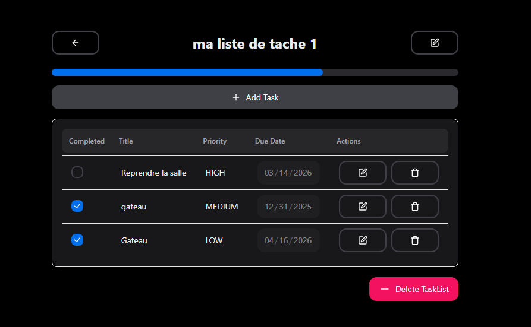
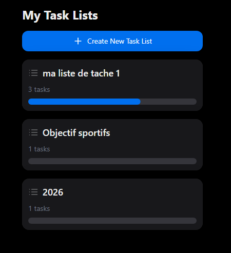

# 📝 Gestionnaire de Tâches API


Ce projet est une API REST développée pour l'apprentissage du framework **Spring Boot**. L'objectif principal était de mettre en pratique les concepts fondamentaux du développement backend avec Java, notamment l'architecture en couches, la persistance des données et la gestion des relations entre entités.

> ⚠️ **Note importante :** Ce dépôt se concentre exclusivement sur la partie **Backend Java**. Le frontend (présent dans le dossier `1-3-tasks-fe`) est fourni à titre d'exemple pour tester l'API mais n'est pas le cœur de ce projet d'étude.

---

## 📸 Aperçu du Projet

### Interface Utilisateur (Frontend de test)
Voici à quoi ressemble l'interface permettant de tester l'API :







### Modélisation des Données
Structure de la base de données PostgreSQL :


---

## 🚀 Fonctionnalités implémentées

- 🔌 **Architecture RESTful** : Gestion complète des listes de tâches et des tâches (CRUD).
- 💾 **Spring Data JPA** : Persistance des données avec PostgreSQL.
- 🔄 **Mapping DTO** : Utilisation de Mappers pour séparer les entités de base de données des objets d'échange API.
- 🛡️ **Validation & Exception Handling** : Gestion centralisée des erreurs (*Global Exception Handler*).
- 🤖 **Automatisation** : Scripts de démarrage et d'arrêt simplifiés.

---

## 🛠️ Prérequis

Avant de lancer le projet, assure-toi d'avoir installé :
* **Java 21** ou supérieur
* **Docker Desktop** (indispensable pour la base de données PostgreSQL)
* **Node.js** (pour lancer le frontend si besoin)

---

## 🚦 Comment lancer le projet

Des scripts sont fournis à la racine pour faciliter le déploiement via Docker.

### 💻 Sur Windows

```batch
# Démarrer l'application et la BDD
./start.bat

./stop.bat 

Sur Linux/Mac
chmod +x start.sh stop.sh

./start.sh

./stop.sh


📂 Structure du projet (Backend)

src/main/java/.../domain : Entités JPA et Objets DTO.

src/main/java/.../repositories : Interfaces Spring Data pour l'accès aux données.

src/main/java/.../services : Logique métier de l'application.

src/main/java/.../controllers : Points d'entrée de l'API.

src/main/java/.../mappers : Conversion entre Entités et DTOs.


🛠️ Configuration de la base de données

Par défaut, le projet est configuré pour se connecter à PostgreSQL 
sur le port 5433 (pour éviter les conflits avec une installation locale 
existante). Ces réglages sont modifiables dans le 
fichier src/main/resources/application.properties
